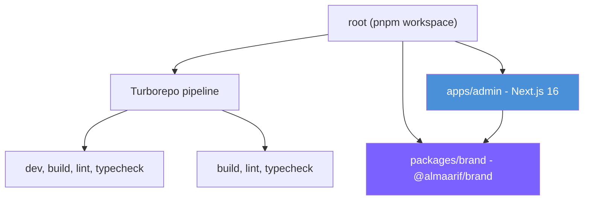
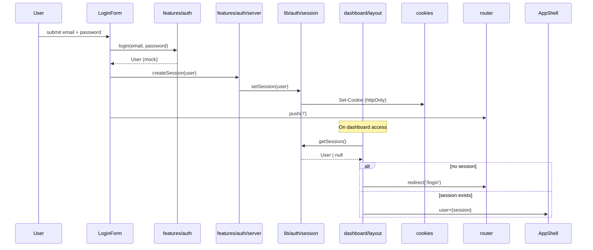
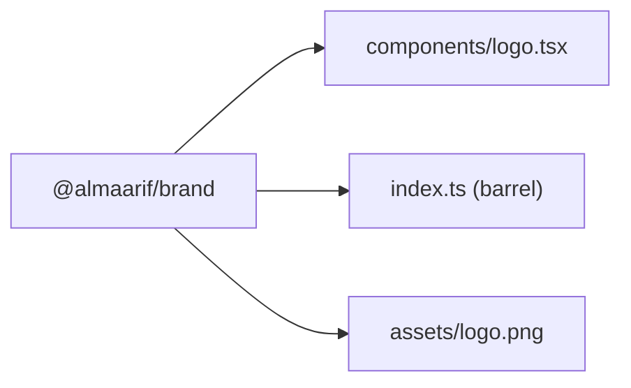
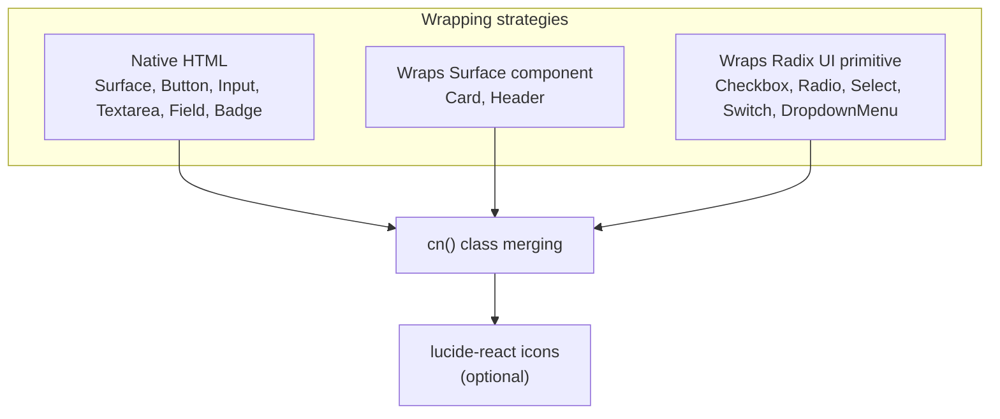
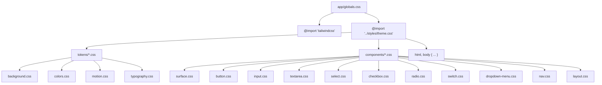
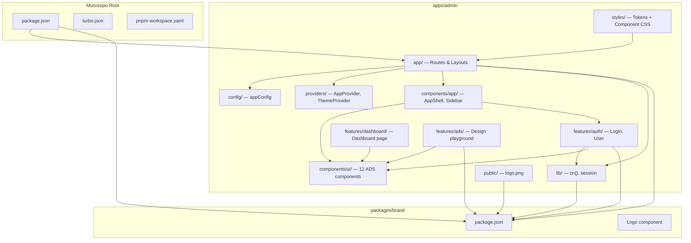
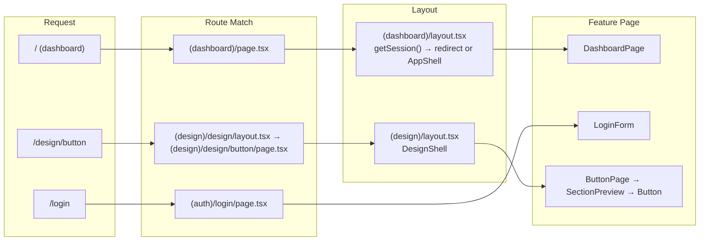
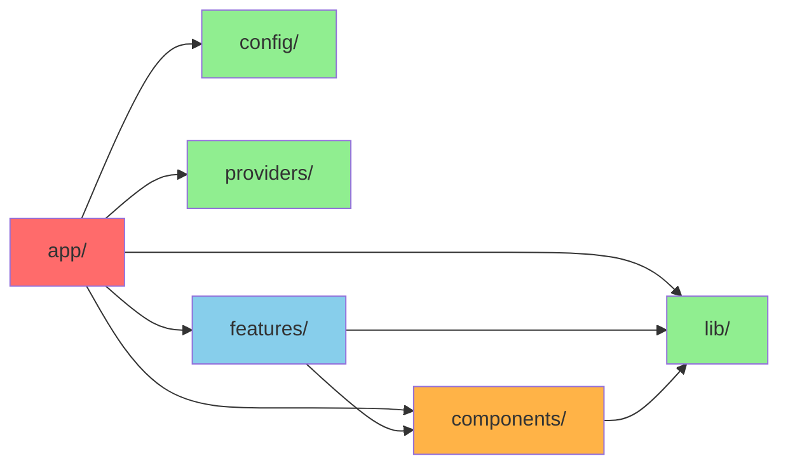

# Architecture Documentation

**Repository:** almaarif-jambi-plus
**Generated:** 2026-07-12
**Branch:** main
**Commit:** c1f0c83b3d56a7604d3a0f497d66cbaf269db626

---

## 1. Repository Overview

almaarif-jambi-plus is a pnpm + Turborepo monorepo for the Almaarif Jambi Plus system — a pondok pesantren (Islamic boarding school) information system. It contains a single application (admin dashboard) built with Next.js 16, React 19, TypeScript 5, and Tailwind CSS v4.

The project features a custom internal design system called ADS (Almaarif Design System) with a "Liquid Glass" visual identity — composable UI primitives built on Radix UI and native HTML elements with glassmorphism styling.

### Stack

| Layer             | Technology                                                |
| ----------------- | --------------------------------------------------------- |
| **Monorepo**      | pnpm workspaces + Turborepo v2                            |
| **Framework**     | Next.js 16 (App Router)                                   |
| **UI**            | React 19                                                  |
| **Language**      | TypeScript 5 (strict)                                     |
| **Styling**       | Tailwind CSS v4 + PostCSS                                 |
| **UI Primitives** | Radix UI (checkbox, radio, select, switch)                |
| **Icons**         | lucide-react                                              |
| **Theme**         | next-themes                                               |
| **Font**          | Montserrat (next/font/google)                             |
| **Linting**       | ESLint 9 (flat config, next/core-web-vitals + typescript) |
| **Formatting**    | Prettier (semi, singleQuote, 100 width, trailing commas)  |
| **Pre-commit**    | Husky + lint-staged                                       |

---

## 2. Monorepo Structure



### Workspace Configuration

```yaml
# pnpm-workspace.yaml
packages:
  - 'apps/*'
  - 'packages/*'
```

### Turborepo Pipeline

```json
{
  "tasks": {
    "dev": { "cache": false, "persistent": true },
    "build": { "dependsOn": ["^build"], "outputs": [".next/**", "dist/**"] },
    "lint": { "dependsOn": ["^lint"] },
    "typecheck": { "dependsOn": ["^typecheck"] }
  }
}
```

The `^` prefix means turbo runs workspace-internal dependency tasks first. When building `admin`, `@almaarif/brand` is built first.

---

## 3. Apps

### `apps/admin` — Next.js 16 Admin Dashboard

The only application. Contains the admin dashboard, authentication flow, and the ADS design system playground.

**Key configuration:**

| File                 | Role                                                                    |
| -------------------- | ----------------------------------------------------------------------- |
| `next.config.ts`     | Empty config (default Next.js 16 behavior)                              |
| `postcss.config.mjs` | `@tailwindcss/postcss` plugin                                           |
| `tsconfig.json`      | `@/*` path alias → project root, strict mode, bundler module resolution |
| `eslint.config.mjs`  | Flat config with next/core-web-vitals + typescript                      |

**Route groups:**

```
app/
├── layout.tsx               # Root layout: font, AppProvider, ThemeToggle
├── globals.css              # Tailwind + theme imports
├── (auth)/
│   └── login/
│       └── page.tsx         # LoginPage → LoginForm component
├── (dashboard)/
│   ├── layout.tsx           # Session guard, AppShell wrapper
│   └── page.tsx             # DashboardPage → stat cards
└── (design)/
    └── design/
        ├── layout.tsx       # DesignShell wrapper
        ├── page.tsx         # DesignSystemPage (overview)
        ├── badge/page.tsx   # (stub — empty)
        ├── button/page.tsx
        ├── card/page.tsx
        ├── checkbox/page.tsx
        ├── colors/page.tsx
        ├── input/page.tsx
        ├── radio/page.tsx
        ├── select/page.tsx
        ├── surface/page.tsx
        ├── switch/page.tsx
        ├── textarea/page.tsx
        └── typography/page.tsx
```

**Authentication flow:**



**Pages by route group:**

| Group         | Pages | Purpose                                             |
| ------------- | ----- | --------------------------------------------------- |
| `(auth)`      | 1     | Login                                               |
| `(dashboard)` | 1     | Dashboard home                                      |
| `(design)`    | 13    | Design system documentation (12 components + index) |

---

## 4. Packages

### `packages/brand` — `@almaarif/brand`

A single-component shared package providing the Almaarif logo.



- **Logo component:** Renders an `` with configurable `src`, `width`, `height`, `alt`, `className`
- **Default src:** `/brand/logo.png` (served from `apps/admin/public/brand/` at runtime)
- **Peer dependency:** `react ^19`
- **ESM only** (`"type": "module"`)

The component still uses `export function Logo()` (function declaration) rather than the project's arrow-function convention.

---

## 5. Features

Features are domain-specific modules under `features/`. Each feature is self-contained with its own components, logic, types, and barrel export.

### Feature map

```mermaid
graph TD
    subgraph features
        AUTH["auth/"]
        DASHBOARD["dashboard/"]
        ADS["ads/"]
    end

    AUTH --> AUTH_TYPES["types.ts - User type"]
    AUTH --> AUTH_TYPES2["auth.ts - login() mock"]
    AUTH --> AUTH_SERVER["server.ts - createSession / destroySession"]
    AUTH --> AUTH_FORM["components/login-form.tsx"]
    AUTH --> AUTH_MENU["components/user-menu.tsx"]

    DASHBOARD --> DASHBOARD_PAGE["pages/dashboard-page.tsx"]

    ADS --> ADS_PAGES["pages/ (13 page components)"]
    ADS --> ADS_SHELL["components/ads-shell/"]
    ADS --> ADS_CODE["components/code-preview/"]
    ADS --> ADS_COLOR["components/color-preview/"]
    ADS --> ADS_SECTION["components/section-preview/"]
    ADS --> ADS_TOKEN["components/token-preview/"]
        ADS --> ADS_THEME["components/theme-toggle/ (now icon-only button)"]
```



### `features/auth`

| File                        | Role                                  | Export                            |
| --------------------------- | ------------------------------------- | --------------------------------- |
| `types.ts`                  | `User` type definition                | `User`                            |
| `auth.ts`                   | Login logic (mock)                    | `login`                           |
| `server.ts`                 | Server actions for session management | `createSession`, `destroySession` |
| `components/login-form.tsx` | Login page form                       | `LoginForm`                       |
| `components/user-menu.tsx`  | User menu (Radix DropdownMenu)        | `UserMenu`                        |
| `index.ts`                  | Barrel                                | `login`, `User`                   |

The `User` type is shared with `lib/auth/session.ts` and `components/app/app-shell.types.ts` (a boundary violation — `lib/` and `components/` depend upward on `features/`).

### `features/dashboard`

| File                       | Role                                    | Export          |
| -------------------------- | --------------------------------------- | --------------- |
| `pages/dashboard-page.tsx` | Dashboard home with stat cards          | `DashboardPage` |
| `index.ts`                 | Barrel (unused — page imports directly) | `DashboardPage` |

### `features/ads`

Design system documentation. Contains 13 page components and 6 utility components for the playground.

| Component        | Role                                    | Interactive? |
| ---------------- | --------------------------------------- | ------------ |
| `DesignShell`    | Layout shell with sidebar navigation    | No           |
| `ThemeToggle`    | Icon-only button (Sun/Moon) in header   | Yes          |
| `SectionPreview` | Section wrapper with title + code block | No           |
| `CodePreview`    | Expandable code block with copy         | Yes          |
| `ColorPreview`   | Color swatch grid display               | No           |
| `TokenPreview`   | Token name/value list                   | No           |

---

## 6. Shared Libraries

### `lib/` — Utility Layer

```
lib/
├── index.ts          # Barrel: re-exports ./utils only
├── utils.ts          # cn() — Tailwind class merger (clsx + tailwind-merge)
├── auth/
│   ├── index.ts      # Barrel: re-exports ./session
│   └── session.ts    # Cookie-based session (getSession, setSession, clearSession)
└── http/
    └── client.ts     # Dead code — generic fetch wrapper, never imported
```

| Function           | Purpose                        | Used by             |
| ------------------ | ------------------------------ | ------------------- |
| `cn(...inputs)`    | Merge Tailwind CSS classes     | All UI components   |
| `getSession()`     | Read user session from cookies | Dashboard layout    |
| `setSession(user)` | Write user session to cookies  | Auth server actions |
| `clearSession()`   | Delete session cookie          | Auth server actions |

### `config/` — Application Config

```
config/
├── index.ts      # Barrel
└── app.ts        # appConfig — name, description, company, url, version
```

Used by root layout for metadata.

### `providers/` — React Context Providers

```
providers/
├── index.ts              # Barrel
├── app-provider.tsx      # AppProvider → wraps ThemeProvider
└── theme-provider.tsx     # ThemeProvider → wraps next-themes ThemeProvider
```

Provider hierarchy:

```
RootLayout
└── AppProvider
    └── ThemeProvider (next-themes, attribute="class", defaultTheme="light")
        └── page content
    ThemeToggle is now inside AppShell header (not floating)
```

---

## 7. Layer Architecture

```mermaid
graph TD
    subgraph "app/ — Next.js Routes"
        LAYOUTS["Layouts<br/>(root, dashboard, design)"]
        PAGES["Pages<br/>(login, dashboard, 13 design pages)"]
    end

    subgraph "features/ — Domain Modules"
        AUTH["auth<br/>login, User, session management"]
        DASHBOARD["dashboard<br/>dashboard page"]
        ADS["ads<br/>design system playground"]
    end

    subgraph "components/ — Reusable UI"
        UI["ui/*<br/>ADS Design System<br/>13 components"]
        APP["app/*<br/>AppShell, Sidebar, MobileNav"]
    end

    subgraph "lib/ — Shared Utilities"
        UTILS["utils.ts - cn()"]
        AUTH_LIB["auth/session.ts"]
        HTTP["http/client.ts<br/>(dead code)"]
    end

    subgraph "config/ + providers/ — App Setup"
        CONFIG["app config"]
        PROVIDERS["theme providers"]
    end

    LAYOUTS --> UTILS
    LAYOUTS --> CONFIG
    LAYOUTS --> PROVIDERS
    LAYOUTS --> AUTH_LIB
    LAYOUTS --> AUTH
    LAYOUTS --> UI
    LAYOUTS --> APP

    PAGES --> AUTH
    PAGES --> DASHBOARD
    PAGES --> ADS

    AUTH --> UTILS
    AUTH --> AUTH_LIB
    AUTH --> UI

    APP --> UI
    APP --> AUTH  {{⚠ "boundary violation"}}

    UI --> UTILS

    AUTH_LIB --> AUTH {{⚠ "boundary violation"}}

    DASHBOARD --> UI

    ADS --> UI

    style AUTH_LIB fill:#f9d71c,stroke:#333
    style APP fill:#f9d71c,stroke:#333
```

### Dependency direction

The intended layering is:

```
app/ → features/ → components/ → lib/
```

But there are two boundary violations:

1. `components/app/` imports from `features/auth/` (UserMenu, User type)
2. `lib/auth/` imports from `features/auth/types` (User type)

These mean `lib/` and `components/` are not pure leaf layers.

---

## 8. Dependency Rules

### Conventions (from AGENTS.md)

- Features should be self-contained
- `lib/` should be a leaf dependency (no upward imports)
- `components/` should depend only on `lib/` and other `components/`
- No feature-to-feature imports (currently clean — auth, dashboard, ads are isolated)

### Current violations

| Violation                            | Source                                 | Target                               | Impact                         |
| ------------------------------------ | -------------------------------------- | ------------------------------------ | ------------------------------ |
| `components/app/` → `features/auth/` | `app-shell.tsx` imports UserMenu       | `features/auth/components/user-menu` | Breaks leaf purity             |
| `components/app/` → `features/auth/` | `app-shell.types.ts` imports User type | `features/auth/types`                | Breaks leaf purity             |
| `lib/auth/` → `features/auth/`       | `session.ts` imports User type         | `features/auth/types`                | Breaks leaf purity; cycle risk |

---

## 9. Import Rules

### Import order (from AGENTS.md)

```
1. React
2. External packages
3. Internal aliases (@/)
4. Relative imports
```

### Path alias

- `@/*` → `apps/admin/*` (defined in tsconfig.json)

### Consistency status

| Pattern              | Files following                 | Files violating                                                        |
| -------------------- | ------------------------------- | ---------------------------------------------------------------------- |
| Import ordering      | Most UI components, pages       | `login-form.tsx`, `app-shell.tsx`, `ads-shell.tsx`, `theme-toggle.tsx` |
| Barrel vs direct     | Most use correct barrel         | `app-shell.tsx` uses direct `'../sidebar/sidebar'`                     |
| UI component imports | Mostly barrel `@/components/ui` | `login-form.tsx` mixes barrel + direct                                 |

All relative imports stay within 1 directory level — no `../../` patterns exist.

---

## 10. Folder Structure

### ADS Component Convention

```
components/ui/component-name/
├── component-name.tsx        # Implementation
├── component-name.types.ts    # TypeScript types
└── index.ts                  # Barrel (export * + export type *)
```

All 12 ADS components follow this convention exactly.

### Feature Convention

```
features/feature-name/
├── index.ts                  # Barrel
├── types.ts                  # Feature-specific types
├── some-logic.ts             # Business logic
├── server.ts                 # Server actions
├── components/
│   ├── some-component.tsx
│   └── ...
└── pages/
    └── some-page.tsx
```

### App Route Convention

```
app/(route-group)/
├── layout.tsx                # Route group layout (default export)
├── page.tsx                  # Route page (default export)
└── segment/
    └── page.tsx
```

Route page files often re-export from `features/`:

```tsx
// app/(dashboard)/page.tsx
export { DashboardPage as default } from '@/features/dashboard/pages/dashboard-page';
```

---

## 11. Design System Architecture

### ADS Component Inventory

| Component    | Category | Primitive          | Client?           | Test? | CSS file?            | CSS classes defined?                                                                                                                   |
| ------------ | -------- | ------------------ | ----------------- | ----- | -------------------- | -------------------------------------------------------------------------------------------------------------------------------------- |
| Surface      | Layout   | `<div>`            | No                | No    | ✅ surface.css       | `ads-surface`, `::before`, `::after`                                                                                                   |
| Card         | Layout   | Surface            | No                | No    | ❌                   | Uses Tailwind only                                                                                                                     |
| Header       | Layout   | Surface            | No                | No    | ❌                   | Uses Tailwind + Surface only                                                                                                           |
| Field        | Layout   | `<div>/<label>`    | No                | No    | ❌                   | Uses Tailwind only                                                                                                                     |
| Button       | Input    | `<button>`         | No                | No    | ✅ button.css        | `ads-button`, `ads-button--{variant}`, `ads-button--{size}`, `ads-button__content`                                                     |
| Input        | Input    | `<input>`          | Yes               | No    | ✅ input.css         | `ads-input`, `ads-input-wrapper`, `ads-input--{size}`, `ads-input--{status}`, `ads-input__loader`, `ads-input__action`                 |
| Textarea     | Input    | `<textarea>`       | Yes (unnecessary) | No    | ✅ textarea.css      | `ads-textarea`, `ads-textarea--{size}`, `ads-textarea--{status}`, `ads-textarea--resize-{resize}`                                      |
| Select       | Input    | Radix Select       | Yes               | Yes   | ✅ select.css        | `ads-select__trigger`, `ads-select__trigger--{size}`, `ads-select__trigger--{status}`, `ads-select__content`, `ads-select__item`       |
| Checkbox     | Input    | Radix Checkbox     | Yes               | No    | ✅ checkbox.css      | `ads-checkbox`, `ads-checkbox__indicator`                                                                                              |
| Radio        | Input    | Radix RadioGroup   | Yes               | No    | ✅ radio.css         | `ads-radio-group`, `ads-radio-item`, `ads-radio-item__label`, `ads-radio`, `ads-radio__indicator`, `ads-radio__dot`                    |
| Switch       | Input    | Radix Switch       | Yes               | No    | ✅ switch.css        | `ads-switch`, `ads-switch__thumb`                                                                                                      |
| Badge        | Display  | `<span>`           | No                | No    | ✅ badge.css         | `ads-badge`, `ads-badge--{variant}`                                                                                                    |
| DropdownMenu | Overlay  | Radix DropdownMenu | Yes               | No    | ✅ dropdown-menu.css | `ads-dropdown-menu`, `ads-dropdown-menu__item`, `ads-dropdown-menu__separator`, `ads-dropdown-menu__label`, `ads-dropdown-menu__arrow` |

### Component patterns



All components use:

- `cn()` from `@/lib` for class merging
- `ads-` prefixed BEM-like CSS classes
- Named exports
- Arrow function components (`export const X = () => ...`)
- TypeScript types co-located in `.types.ts` files
- `type` over `interface` (all converted)
- Intersection types for extending native HTML/Radix props

### Props architecture

Each component follows one of these patterns:

| Pattern                   | Examples                                                                  |
| ------------------------- | ------------------------------------------------------------------------- |
| Extends native HTML attrs | `ButtonProps = ButtonHTMLAttributes<HTMLButtonElement> & { ... }`         |
| Extends Radix attrs       | `CheckboxProps = Omit<ComponentPropsWithoutRef<'button'>, ...> & { ... }` |
| Standalone custom         | `FieldProps = { label?, description?, error?, ... }`                      |

### CSS architecture



**Tokens (20 remaining CSS custom properties):**

| Token                                                                          | Category   | Used by                                                          |
| ------------------------------------------------------------------------------ | ---------- | ---------------------------------------------------------------- |
| `--background`                                                                 | Background | body, theme.css                                                  |
| `--background-page`                                                            | Background | body                                                             |
| `--surface`                                                                    | Surface    | surface.css                                                      |
| `--text-primary`                                                               | Text       | All components                                                   |
| `--text-secondary`                                                             | Text       | All components                                                   |
| `--border`                                                                     | Border     | All components                                                   |
| `--brand`, `--brand-soft`                                                      | Brand      | switch.css                                                       |
| `--success`, `--warning`, `--danger`                                           | Status     | colors-page.tsx, input.css, textarea.css, select.css, button.css |
| `--button-primary`, `--button-primary-shadow`                                  | Button     | button.css                                                       |
| `--button-secondary`, `--button-secondary-border`, `--button-secondary-shadow` | Button     | button.css                                                       |
| `--button-ghost-hover`                                                         | Button     | button.css                                                       |
| `--button-danger`                                                              | Button     | button.css                                                       |
| `--motion-normal`, `--motion-ease`                                             | Motion     | surface.css                                                      |

Remaining tokens from Tailwind v4 defaults (not defined in source but referenced): `--shadow-sm`, `--shadow-md`, `--shadow-lg`, `--blur-lg`, `--radius-3xl`.

---

## 12. Data Flow

### Request lifecycle

```mermaid
sequenceDiagram
    participant Browser
    participant NextJS as Next.js Server
    participant Layout
    participant Session as lib/auth
    participant Feature

    Browser->>NextJS: GET / (dashboard)
    NextJS->>Layout: (dashboard)/layout.tsx
    Layout->>Session: getSession()
    Session->>NextJS: cookies()
    NextJS-->>Session: cookie store
    Session-->>Layout: User | null

    alt No session
        Layout->>Browser: redirect /login
        Browser->>NextJS: GET /login
        NextJS->>Feature: LoginPage → LoginForm
        Feature-->>Browser: Login form HTML
        Browser->>NextJS: POST login (email, password)
        Note: LoginForm calls login() then createSession()
        NextJS->>Browser: redirect / (dashboard)
    else Session exists
        Layout->>NextJS: <AppShell user={session}>
        NextJS->>Feature: DashboardPage
        Feature-->>Browser: Dashboard HTML
    end
```

### Data flow rules

- **No state management library** — React state only (useState, useSyncExternalStore)
- **No API routes** — authentication uses Next.js Server Actions (`'use server'`)
- **No database** — auth is currently mock-only
- **Session** — Cookie-based, httpOnly, server-side only (getSession is async server function)
- **Theme** — next-themes, persisted to localStorage via `class` attribute

---

## 13. State Management

The project intentionally has no state management library.

### State categories

| Category        | Mechanism             | Examples                                                                                           |
| --------------- | --------------------- | -------------------------------------------------------------------------------------------------- |
| Component-local | `useState`            | Input password toggle, CodePreview expand/copy, CheckboxPage/RadioPage/SwitchPage controlled state |
| Theme           | next-themes (context) | ThemeToggle                                                                                        |
| Session         | Cookie (server-side)  | Dashboard layout, auth server actions                                                              |
| Async           | None yet              | login() mock, no React Query usage yet                                                             |

### `'use client'` directive usage

| Category      | Count | Components                                                                          |
| ------------- | ----- | ----------------------------------------------------------------------------------- |
| Correct usage | 5     | Input (uses useState), Checkbox/Radio/Select/Switch (Radix requires client context) |
| Unnecessary   | 1     | Textarea — no hooks, no browser APIs, no event handlers requiring client            |

---

## 14. Naming Conventions

### Files

| Type       | Convention   | Example                               |
| ---------- | ------------ | ------------------------------------- |
| Components | kebab-case   | `login-form.tsx`, `code-preview.tsx`  |
| Types      | `*.types.ts` | `button.types.ts`, `surface.types.ts` |
| Tests      | `*.test.tsx` | `select.test.tsx`                     |
| Styles     | `*.css`      | `button.css`, `layout.css`            |
| Utilities  | camelCase    | `utils.ts`, `session.ts`              |
| Config     | camelCase    | `app.ts`, `config/index.ts`           |

### Exports

| Type       | Convention                           | Examples                            |
| ---------- | ------------------------------------ | ----------------------------------- |
| Components | Named export                         | `export const Button = ...`         |
| Pages      | Default export (Next.js requirement) | `export default function LoginPage` |
| Utilities  | Named export                         | `export const cn = ...`             |
| Types      | Named type export                    | `export type ButtonProps = ...`     |

### CSS classes

| Convention     | Pattern                       | Example               |
| -------------- | ----------------------------- | --------------------- |
| Component root | `ads-{component}`             | `ads-button`          |
| Element (BEM)  | `ads-{component}__{element}`  | `ads-button__content` |
| Modifier (BEM) | `ads-{component}--{modifier}` | `ads-button--primary` |

### Variables

| Category         | Convention       | Example                                      |
| ---------------- | ---------------- | -------------------------------------------- |
| JavaScript       | camelCase        | `isLoading`, `appConfig`, `designNavigation` |
| CSS custom props | kebab-case       | `--text-primary`, `--button-primary`         |
| Constants        | UPPER_SNAKE_CASE | `SESSION_KEY`                                |
| Props            | camelCase        | `leftIcon`, `onCheckedChange`                |

---

## 15. Coding Conventions

Inferred from the repository codebase and AGENTS.md:

### Component structure (all components follow this)

```tsx
import { cn } from '@/lib';

import type { ComponentProps } from './component.types';

export const Component = ({ className, ...props }: ComponentProps) => (
  <div className={cn('ads-component', className)} {...props} />
);
```

### Props type pattern

```tsx
// Extends native HTML (Surface, Button, Card, Input, Textarea)
export type ComponentProps = NativeHTMLAttributes<HTMLElement> & {
  customProp?: string;
};

// Extends Radix (Checkbox, Radio, Select, Switch)
export type ComponentProps = ComponentPropsWithoutRef<typeof Primitive.Root>;

// Standalone (Select, Field, Header)
export type ComponentProps = {
  customProp: string;
};
```

### Arrow functions over function declarations

```tsx
// Preferred
export const Component = () => { ... };

// Not used in source (except @almaarif/brand Logo)
export function Component() { ... }
```

### Named exports over default exports

- Components: always named
- Pages: default (Next.js requirement)
- Barrel files: `export *` / `export type *`

### No `interface` — prefer `type`

All type declarations in the project are `type` not `interface` (refactored in a prior session).

### Tailwind-first styling

Components prefer Tailwind utility classes. Dedicated CSS files are only used for:

- Pseudo-elements (`::before`, `::after`)
- Complex selectors (`:focus-visible`, `:disabled`, Radix `[data-state]`)
- Animation keyframes
- Design tokens

---

## 16. Testing Strategy

### Current state

- **1 test file** exists: `select.test.tsx`
- **No test runner** configured — `@testing-library/react` and test runner types not installed
- **No `test` script** in `package.json`
- **9 TypeScript errors** from the test file due to missing type declarations

### AGENTS.md test requirements

Tests should cover:

- Rendering
- Variants
- Interactions
- Accessibility when applicable

### Status by component

| Component | Test exists?     | Expected tests                                                                    |
| --------- | ---------------- | --------------------------------------------------------------------------------- |
| Surface   | No               | Render test                                                                       |
| Button    | No               | Render, variants (primary/secondary/ghost/danger), sizes, loading/disabled states |
| Card      | No               | Render with heading/description/footer                                            |
| Header    | No               | Render with title/logo/actions                                                    |
| Input     | No               | Render, password toggle, loading/error/disabled states                            |
| Textarea  | No               | Render, sizes, resize variants, error state                                       |
| Select    | Yes (unrunnable) | Render, open/close, option selection                                              |
| Checkbox  | No               | Render, checked/unchecked, disabled                                               |
| Radio     | No               | Render, group selection, disabled                                                 |
| Switch    | No               | Render, toggled/untoggled, disabled                                               |
| Field     | No               | Render with label/error/description                                               |
| Badge     | No               | Render with variants                                                              |

---

## 17. Future Scalability

### What scales well

- **Monorepo structure** with Turborepo — adding new apps (`apps/mobile-api`, `apps/public`) is trivial
- **Feature-based architecture** — new features like `students`, `attendance` fit cleanly into `features/`
- **Design system** is composable and reusable across future apps
- **Radix UI primitives** provide accessible foundation that can be extended
- **TypeScript strict mode** catches issues early
- **Path aliases** make refactoring safer

### What needs attention for scale

| Issue                          | Impact                                                       |
| ------------------------------ | ------------------------------------------------------------ |
| No `src/` directory            | Can cause confusion as codebase grows                        |
| Boundary violations            | Will create circular deps as more features are added         |
| No testing infrastructure      | Cannot safely refactor                                       |
| Mock authentication            | No real auth for production                                  |
| Dead code (badge, http client) | Maintains confusion about what's usable                      |
| Unused dependencies            | Wasted install time and disk space                           |
| No API layer                   | All data is mock — real endpoints will require restructuring |
| No error boundaries            | Any runtime error crashes the full app                       |
| No loading skeletons           | Dashboard content shows nothing while data loads             |

---

## 18. Known Technical Debt

### High

| #   | Issue                                   | File(s)                                             |
| --- | --------------------------------------- | --------------------------------------------------- |
| 4   | 6 unused admin dependencies installed   | `apps/admin/package.json`                           |
| 5   | 7 unused root dependencies installed    | Root `package.json`                                 |
| 6   | `lib/http/client.ts` is completely dead | `lib/http/client.ts`                                |
| 7   | No test runner configured               | `select.test.tsx` has 9 TS errors                   |
| 8   | Package boundary violations             | `app-shell.tsx`, `app-shell.types.ts`, `session.ts` |
| 9   | Header and Field have no docs/route     | Missing from design system navigation               |

### Medium

| #   | Issue                                             | File(s)                                                                |
| --- | ------------------------------------------------- | ---------------------------------------------------------------------- |
| 10  | Unused barrel exports                             | `features/dashboard/index.ts`, `sidebar/index.ts`                      |
| 11  | Import ordering inconsistencies                   | `login-form.tsx`, `app-shell.tsx`, `ads-shell.tsx`, `theme-toggle.tsx` |
| 12  | Mixed direct/barrel UI imports                    | `login-form.tsx`                                                       |
| 13  | `components.json` points to nonexistent hooks dir | `components.json`                                                      |
| 14  | Unused `public/brand/logo.png`                    | `public/brand/logo.png`                                                |

### Low

| #   | Issue                                                          | File(s)                              |
| --- | -------------------------------------------------------------- | ------------------------------------ |
| 15  | Textarea has unnecessary `'use client'`                        | `textarea.tsx`                       |
| 16  | Logo component uses function declaration                       | `packages/brand/components/logo.tsx` |
| 17  | Navigation links to `/users` and `/settings` — no routes exist | `sidebar.tsx`                        |

### Already resolved

- Empty CSS files and unused theme tokens — cleaned in prior sessions

---

## 19. Mermaid Diagrams

### Complete architecture overview



### Route resolution flow



### Dependency graph (clean view)


